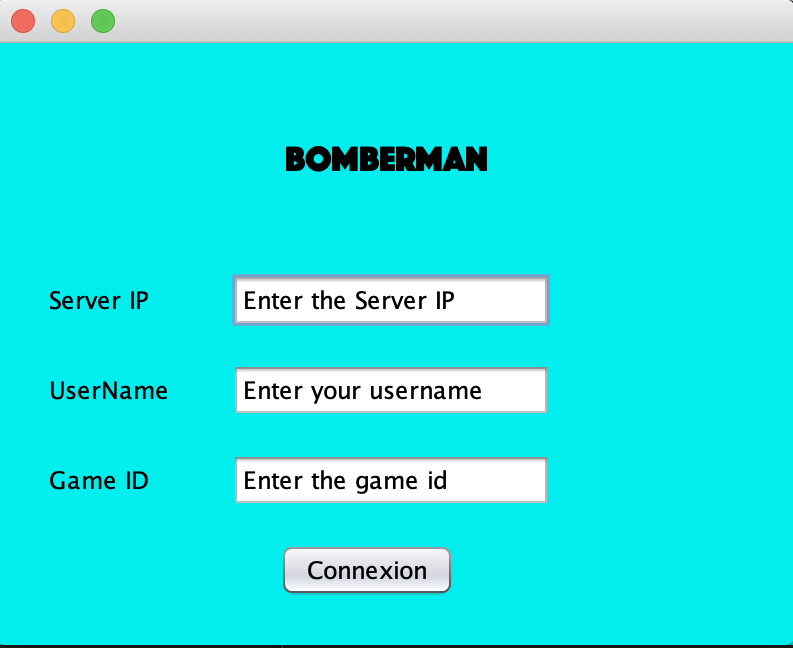
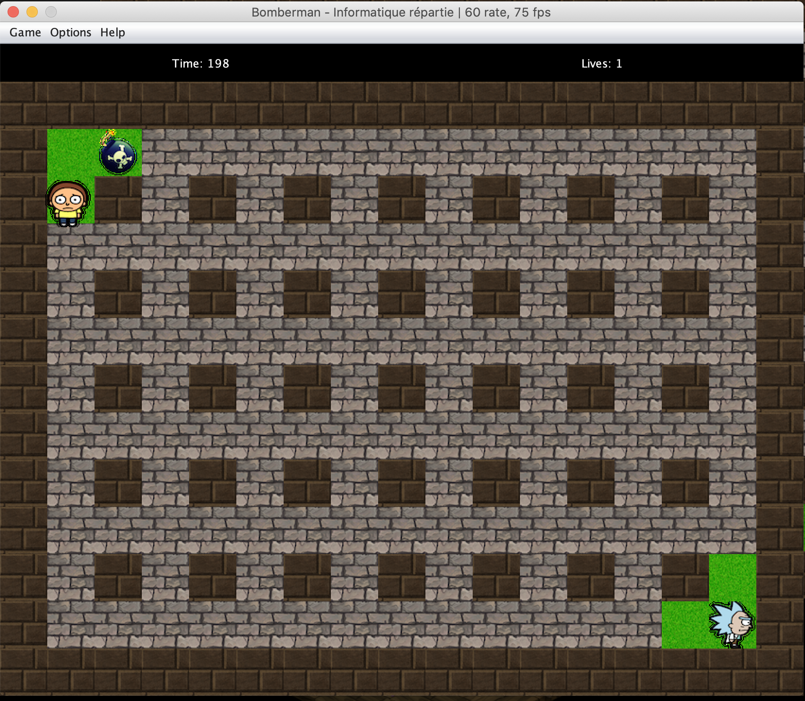

# Distributed programming - Bomberman

## Introduction

The goal of this project is to transform a game playable on one computer to a 2-Player game on 2 different computer.

## Tech used 
We chose to use Java RMI.

## Files on the repo

- src/ the code folder. Constains the original project and the client and server module we added
- data/ the data used by the program (level map and textures)
- classes/ when the .class files will be stored
- uml/ contains conception explanation.

## Screen of the game

## UserGuide
 - Computer 1 (If on 2 computers)
  1. Compile everything : `ant compile`
  2. Start `rmiregistry` in the ./classes folder
  3. On another terminal, start the server `ant runServer` (the IP of you server will be be 127.0.0.1) if you want another ip start it using `java -cp classes server.Server X.X.X.X`
  4. Open a third terminal and start a client `ant runClient`
  5. On the IHM enter the info
  6. Click one time on connexion

 - Computer 2
  1. Compile everything : `ant compile`
  2. Just open a terminal and start a client `ant runClient`
  3. On the IHM enter the info
  4. Click one time on connexion
 
 - You can remove all compiled files using `ant clean`

## How the play the game
 - You can move your character using the arrows of your keyboard
 - The goal is to kill you oponent using a bomb you can place
 - You can place a bomb by pressing the space bar
 - The bomb can destoy walls and kill you or your oponent
 - The bomb you place explodes after a few seconds

## GIT used
[https://github.com/carlosflorencio/bomberman](url)
